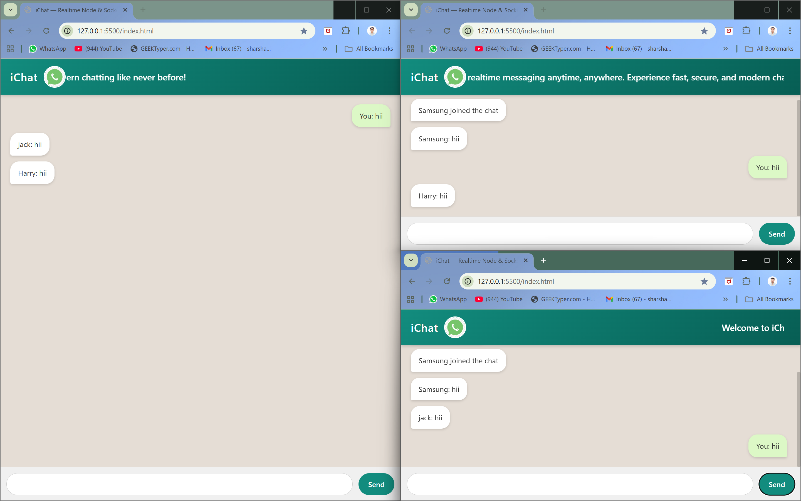
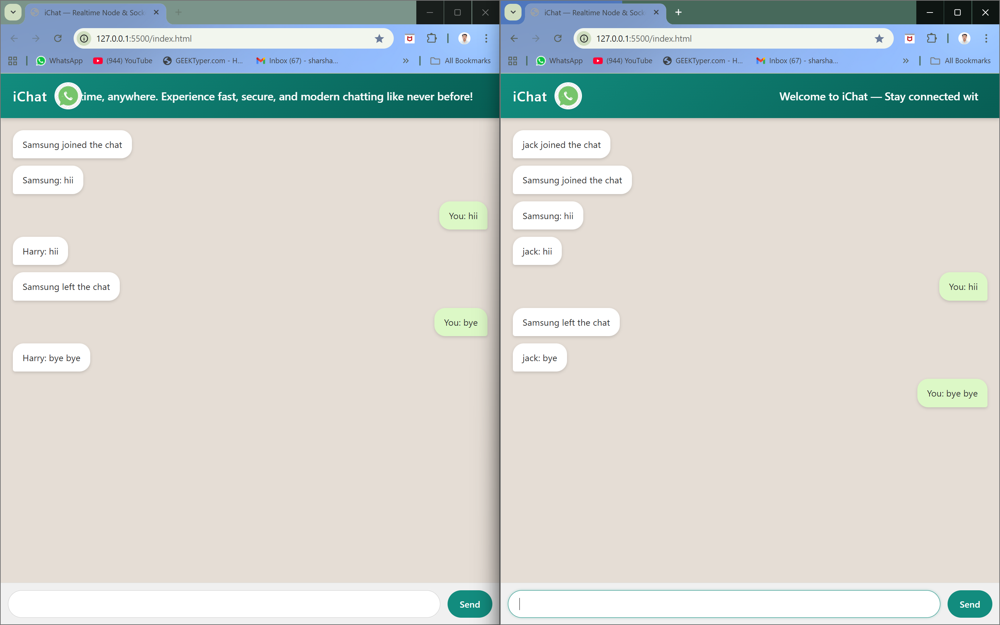

# iChat
iChat is a realtime chat app similar to WhatsApp, developed using Node.js, Express, and Socket.io. It allows multiple users to connect, send and receive messages instantly, and see live join/leave updates. The UI is designed to be clean, modern, and responsive — providing a smooth messaging experience in the browser.

# 💬 iChat — Realtime Chat App

🚀 *Realtime messaging made simple — iChat brings WhatsApp-style communication to your browser.*

iChat is a WhatsApp-like realtime chat application built with **Node.js, Express, and Socket.io**.  
It enables instant messaging between multiple users with features like:

- 🔔 User join/leave notifications  
- 💬 Realtime message broadcasting  
- 📱 Clean & responsive UI  
- ⚡ Lightweight and fast  

---

## 📸 Screenshots

### Chat UI


### User Join/Leave Notification



---

## 🛠️ Tech Stack

- **Frontend:** HTML, CSS, JavaScript  
- **Backend:** Node.js, Express  
- **Realtime Communication:** Socket.io  

---

## ⚙️ Installation & Setup

1. Clone this repository  
   ```bash
   git clone https://github.com/your-username/ichat.git
   cd ichat

2. Install dependencies
   ```bash
   npm install

3. Start the server
   ```bash
   node index.js

Or(if you use nodemon):
   ```bash
   nodemon index.js
